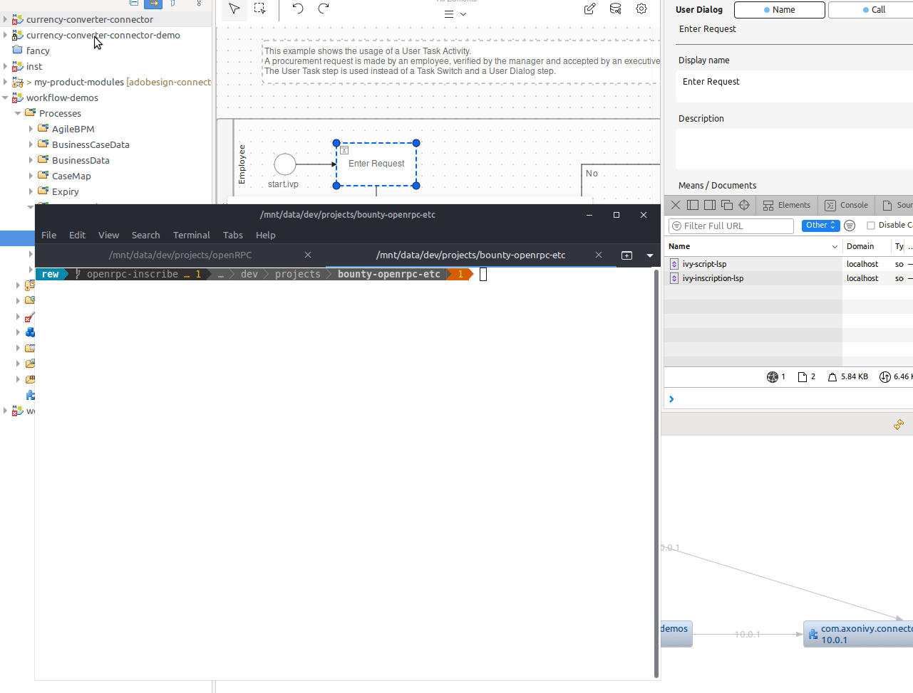

# openRPC

inscription LSP playground:

https://open-rpc.org/

## goal
write first openrpc docs for our inscriptions and identify the value that derives from it.

### CLI
use independent third-party clients for testing: https://socket.dev/npm/package/@xops.net/openrpc-cli
works after updating and forking it: https://github.com/ivy-rew/openrpc-cli

